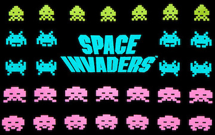
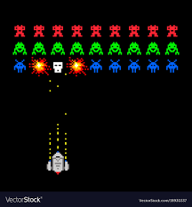

# Space Invaders

Space Invaders is inspired by the 1978 game made by Tomohiro Nishikado ([Space Invaders](https://en.wikipedia.org/wiki/Space_Invaders)). The User's ship will be located at the bottom of the screen and be able to move horizontally and shoot at enemies that appear from above. Each time a player shoots down an enemy ship the user will receive points and the game ends when the player is either touched by an enemy ship.

## Functionality and MVP Features

- Player can destroy enemies by shooting it down
- Player can be destroyed by an enemy
- Player can earn points by shooting down enemies
- Enemies move faster toward the player at each level
- Player can earn power ups (Bonus)

## Architecture and Technologies

- HTML Canvas
  - Allows for rendering 2D shapes onto the browser window
  - Will be used to render game objects
- Javascript
  - Allows the application to compute how to respond to user interations
  - Will be used to handle game logic
- HTML & CSS
  - Used for templating and styling
- Express JS
  - Node framework that listens and responds to requests
  - Will be used as my server to send files to the user

## Implementation Timeline

### Day 1

- [ ] Create node server and font end files
- [ ] Learn HTML Canvas

### Day 2

- [ ] Find and save assets for ship
- [ ] Create any additonal assets necessary for game

### Day 3

- [ ] Render player ship
- [ ] Allow player ship to move horizontally on the screen
- [ ] Configure ship to be able to fire at enemies

### Day 4

- [ ] Render Enemies on the screen
- [ ] Allow Enemies to move about the screen
- [ ] Allow Enemies to shoot at player

### Day 5

- [ ] Add logic to compute enemy being hit by shot
- [ ] Add logic to handle player being destroyed by enemy
- [ ] Add logic to keep score

### Day 6

- [ ] Add logic for multiple levels
- [ ] Style welcome screen

### Day 7

- [ ] Style application to be portfolio ready

